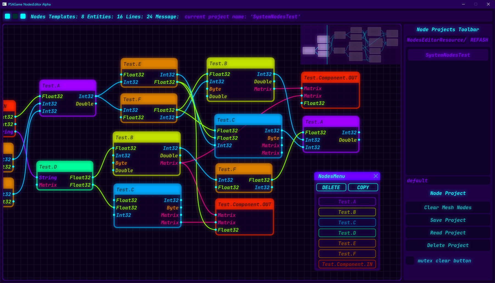

# PSA Node Editor

> 数据驱动的 轻量级 通用 节点编辑器

__version:__ `1.0.1.20241222 alpha`

__library:__ `OpenGL3` `GLFW` `GLEW` `STB_IMAGE` `ImGui` `ImNodes` `RapidJSON`

__update:__ `2024.12.22` `RCSZ`

---

### NodeEditorV1

> 这是一个完整的科技风格的"节点编辑器", 界面以及节点基础构建基于ImGui与ImNodes. 编辑器包含节点项目的保存和加载, 节点数据导出以及基础的鼠标菜单和节点编辑功能.

- [节点编辑器使用](docs/node_editor_usage.md)
- [节点属性配置](docs/node_editor_config.md)
- [节点数据导出](docs/node_editor_export.md)

`MSVC` `C++17` `x64` `LoC:2472`

- [ImGui](https://github.com/ocornut/imgui)
- [ImNodes](https://github.com/Nelarius/imnodes)

---

[前往BiliBili视频](https://www.bilibili.com/video/BV1BykhYaEmm/?share_source=copy_web&vd_source=13ed11b7c6628f0aef39803f8e802f5b)