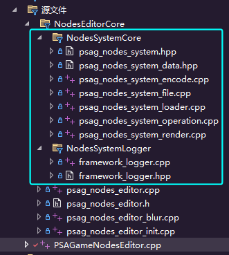

# Node Editor Usage

__Update:__ `2024.12.22` `V101` `RCSZ`

---

### 概述
- __V101:__ 整个项目其实分为两部分, 您可以剥离OpenGL的渲染部分, 只取编辑器的核心渲染逻辑, 但是需要和日志系统一起移植. 是的包括"发光"功能都是属于外部的渲染部分, 不包括在编辑器核心里. 如果您需要移植, 可以参考下图框选部分代码. 整个编辑器项目界面采用固定暗紫色配色, 目前不提供自定义颜色. 



---
### 基础绘制调用
- __V101:__ 如果您剥离移植了核心部分, 那么您需要更加注意以下的调用. 属性配置文件参考: [节点属性配置](node_editor_config.md)

```cpp
// 定义
PSAnodesRender::NodesEditorRender* NodesEditor = nullptr;

/* 在您的初始化阶段创建它, ImGui上下文必须创建完成后才能进行
*
* param: "attrib_cfg" 节点属性配置文件(.json) 路径
* param: "types_cfg" 连接点属性配置文件(.json) 路径
*/
NodesEditor = new PSAnodesRender::NodesEditorRender(attrib_cfg, types_cfg);

/* 在您的渲染循环中调用帧绘制
*
* param: "size" 编辑器窗口大小 (注意: 调整时可能需要配合全局字体缩放)
* param: "flag" true: 固定窗口位置为左上角
*
* 对于 "size" 我们建议最小不要小于 1280 x 720
*/
NodesEditor->DrawEditorWindowFrame(size, flag);

// 完整方法
void DrawEditorWindowFrame(
	const ImVec2&    size,         // 窗口大小
	bool             fixed = true, // 固定为左上角
	ImGuiWindowFlags flags = NULL  // 窗口标志
);

// 是的到这里最基础的调用就完成了, 非常简单.
```

- 设置&数据操作, 具体的编辑器所有数据定义格式可以前往 "psag_nodes_system_data.hpp" 文件查看. 导出数据参考: [节点数据导出](node_editor_export.md)
```cpp
// 设置 默认项目检索文件夹(目录)
void NEP_SettingDefaultFolder(const std::string& path);
// 设置 默认项目保存名称
void NEP_SettingDefaultName(const std::string& name);

// 获取 全局项目标识名称
std::string NDC_GetProjectName();
// 获取 节点模板数据(配置源信息)
NodeTempsPtr NDC_GetNodeTemplates();
// 获取 节点实体数据(已分配UID正在绘制的节点)
NodeEntisPtr NDC_GetNodeEntities();

// 导出 当前正在绘制中的节点实体数据
std::string ENC_ExportCurrentData(PSAnodesEncode::PSAencoderPFN funcptr);
```

---

### 编辑器操作

- __V101:__ 
  * `1` 界面顶部显示栏, 三个模拟'LED'分别描述: 当前运行状态, 锁定清理删除项目按钮状态, 鼠标菜单打开状态. 
  * `2` 鼠标右键打开节点菜单, 点击任意非菜单内或者进行一次操作后菜单自动关闭. 
  * `3` 界面右半工具栏, 点击选择项目后下面按钮操作为当前项目, 再此点击可解除当前项目绑定, 可以通过顶部显示信息判断. 底部锁定选择框激活后, 清理所有节点和删除项目按钮都将被锁定(失效). 
  
---

Thank you for using !